# Designing with Figma: Day 2

## Table of Contents

* Design ethics
  * Plagiarism
  * Diversity & inclusion
  * Accessibility
* Creating a mockup
  * Anchors
  * Boolean groups
  * Adding texture
  * Smart selection and distributed spacing
  * Using libraries and styles
  * Finding and using graphics
* Workflow
  * The magic keys
  * Pages
  * Naming conventions + batch rename
  * Comments 
  * Exporting
* Further reading

## Day 2

Welcome back to Designing with Figma! I hope you've learned something from the [last workshop](https://github.com/uclaacm/tla-dev-intern-training-w21/blob/main/week-3p-designing-with-figma/Figma%20Day%201.md) and are ready to dig deeper into web design.

In the last workshop, we covered the basics of getting up and running with Figma, from basic wireframes to prototypes. We learned about planning a design with colors, style guides, and mood boards. Now, as you're refining some details in your design, inserting specific graphics, and weighing the pros and cons of special effects and features, you have probably started asking questions about 

### Design ethics

[Ethical design](https://www.figma.com/resources/learn-design/ethics/) should ideally be worked in from the very beginning of a project. It's easier to know early on which designs will work best for your audience, than to go back later and overwrite inaccessible designs.

Here, I've listed two of the most important considerations, although really it'd be best to take an ethics course to get a fuller picture (no pun intended).

#### Inclusion

What kind of people are you representing in your designs? What supportive features have you included in your products? Are you playing into stereotypes about what certain people can or should do? Inclusion is ultimately a complex topic, and educating ourselves is a long-term effort, but it's worthwhile for reasons both ethical and practical. 

The real world contains all kinds of different people, and too often designers fail to take that into account. In psychology we often talk about ["Reference Man"](https://www.youtube.com/watch?v=CVdn-2KE2bs): a white, slim, neurotypical male who has been assumed to be the standard user for products from [medicines](https://themedicinemaker.com/discovery-development/the-drug-dose-gender-gap) to [Kodak film](https://www.nytimes.com/2019/04/25/lens/sarah-lewis-racial-bias-photography.html), with serious consequences for people who don't fit that description. 

The point is, we can't assume that an entire population experiences the world in the same way as Reference Man. Different aspects of identity such as gender, ethnicity, body type, age, language or immigration status, and ability can and do affect ways in which people use products.

Precisely because inclusion considers the diversity of real-world populations, it often ends up benefitting more people than originally intended. Below is a beautiful graphic from [Microsoft's accessibility guides](https://www.microsoft.com/design/inclusive/) illustrating how accessible design helps serve not only disabled individuals and communities, but also people who need temporary extra support because of situations like loud airports or multitasking. 

Beyond considering features that might support a diverse population of users, we can also consider how we accurately represent the diversity of this audience *within* our designs, whether in photos, illustrations, emojis, or even video-game character customization.

When in doubt, consider respectfully reaching out to organizations who offer their services for diversity consultation, and compensate them for their time. 

And if you're a struggling college student, start with free guides like those by [@commandurr](https://www.instagram.com/p/CBYU37fFzmP/) (one of my favorite web comic artists), [Kat Tsai](https://chuwenjie.tumblr.com/post/158694460814) of Steven Universe, [Jessi Eoin](https://medium.com/@jbeoin/how-to-draw-disabled-people-53cc48434532), or [@Phobos-Romulus](https://www.deviantart.com/phobos-romulus/art/Female-Body-Types-Tutorial-468154376). You can still support artists for free by following, liking, and reposting their stuff:)

Inclusivity isn't a question of "political correctness": plenty of quantitative research shows that seemingly surface-level images have real-life impacts on people, especially growing children who are learning about who they can be in this world. The goal is **inclusion**, not **tokenism**. Check out [further reading]() at the end of this article for some academic papers.

In the next section, we'll see some examples of how Learning Labs might think about accessibility.

#### Aesthetics versus accessibility

What do you think about hamburger menus (the three lines that indicate a menu, often found on apps)? What about GIFs, or icons?

Designers (including me) often get caught up in what looks cool and forget to consider what's usable. [Hamburger menus](https://www.nngroup.com/articles/hamburger-menus/) have been shown to unnecessarily hide useful information. [Too-fast GIFs can be triggering](https://www.w3.org/TR/WCAG20-TECHS/G152.html) to users prone to seizures.

And did you know that [few icons are truly universal](https://www.nngroup.com/articles/icon-usability/)? Other than expressions such as :smile:, icons can be difficult for international, elderly, and other populations to understand, especially those who are not as familiar with what many assume to be a shared code.

Trends exist for a reason&mdash;they're quite good in some circumstances. Hamburger menus are great for tiny phone screens. Icons are nice for illustrating menu items and other options, but the best route is to label most icons redundantly with text.

Although it may not seem that way, accessible designs are also often more aeshetically pleasing: they are cleaner, more balanced, and easier on the eye.

Many applets and plugins exist on the web for checking accessibility, but 

#### Plagiarism

When you use someone else's work as inspiration, are you plagiarizing?

Many cases of plagiarism are unintentional. However, it is often malicious. There are a ton of examples on the internet of up-and-coming artists' work getting stolen.

One of the most famous examples is the work of Barbara Kruger.

Look familiar? [Read her statement](https://www.thecut.com/2017/11/i-think-about-when-barbara-kruger-dragged-supreme-a-lot.html) on a lawsuit that Supreme filed against a third party for copyright infringement.

The line between inspiration and plagiarism can seem fuzzy, but in general: if you are profiting off of work that someone could reasonably mistake for the work of a different artist, you are seriously plagiarizing. Feel free to use mood boards as inspiration, but not as templates.

Above, I've tried to give you a sense of the importance of ethical design, including representation, accessibility, and intellectual property. My hope is that you continue to consider these aspects as we continue refining our designs, both today and in the future.

### Creating a mockup

#### Detailed shapes

Figma is a vector-based application, which means that shapes are mathematically defined by **anchor points** and the connections between them.

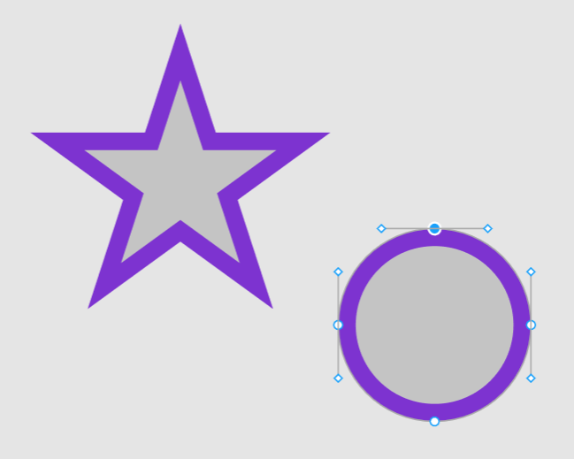

In Figma, anchor points are represented by blue circles. You can select and drag them to alter the shape (multi-select by holding Shift).

Anchors also have handles, which are the blue diamonds sticking out from each point. If you've never worked with a design application before, these can be a bit difficult to get used to, but I promise you only have to learn it once&mdash;and then the whole world of design applications opens up for you.

If you do want to learn more about anchors, shapes, and the magical, wonderful centerpiece of drawing applications called the Pen tool, I highly recommend the [Bezier web app](bezier.method.ac), which taught me in five minutes what I unsuccessfully tried to learn on my own for five years.

Or, for an often more intuitive and precise way of working with shapes that translates well to the modern age, read on.

### Boolean groups

I do not know who first came up with the technology for Boolean groups, but this workflow has become one of my main design tools. 

Let's say that I, while working on Learning Labs, decided to research logos of education organizations. 

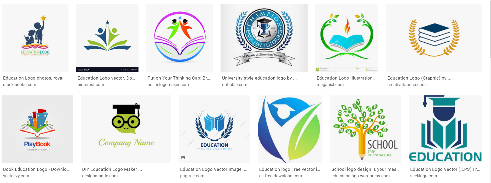

I decide that a simple image of a leaf is a motif associated with growth and education, and that I want to incorporate it into the Learning Labs logo. So I draw a circle and a triangle:

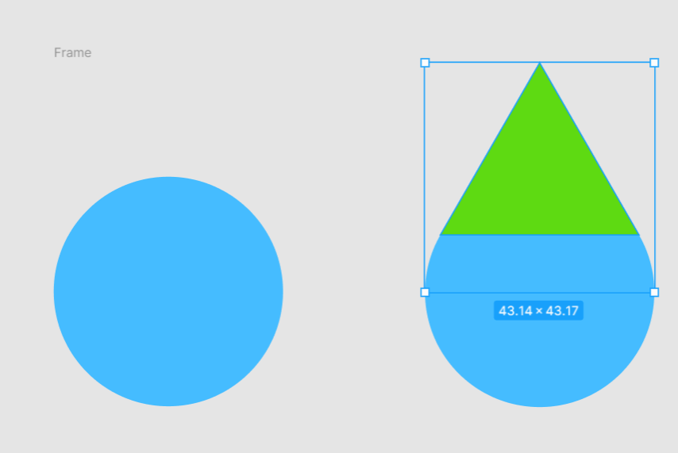

And I go up to the menu bar and click on the arrow next to the icon with the two squares:

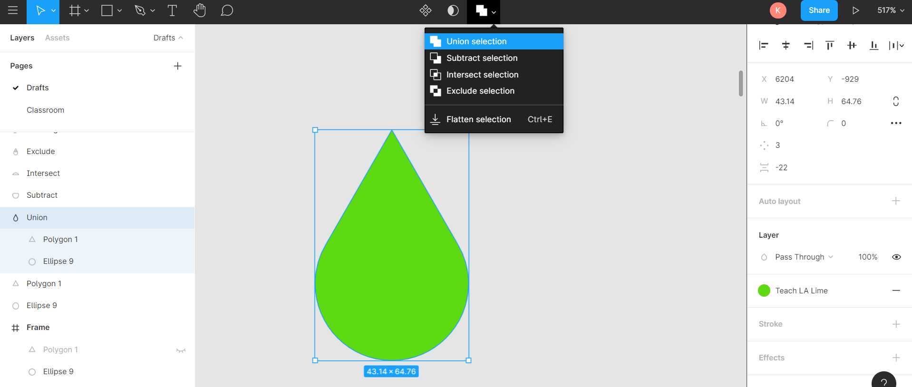

You can see from the unbroken outline that we have now created a shape merging both of the components into one. In the layers panel, you can see that the underlying components are still there, just contained in a special type of group that *changes the relationship* between the components (the Boolean group). In the case of Union groups, the components are treated as one continuous object instead of two separate objects.

We are still free to move around the components and adjust the properties of the overall shape, if we want.

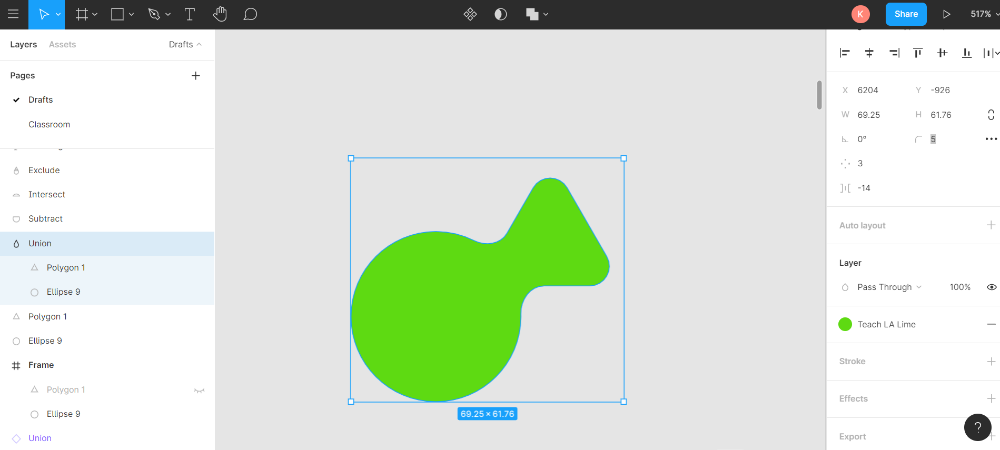

You can use the icons in the dropdown menu as guides to experiment with the other Boolean groups, which have different rules for how to combine the components. 

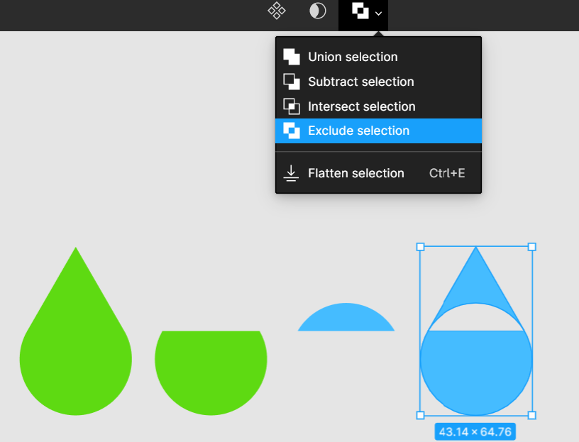 

Finally, I added text and arranged the new shape to create a logo for our Learning Lab:

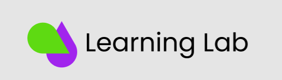

The above is a simple example, but you can imagine how powerful this function can be. Any complex shape can technically be broken into smaller and simpler shapes, a concept important in both calculus and graphic design.

To show you the possibilities of boolean groups, here is an astronaut I created recently, composed completely of simple shapes. 

(Again, I do not recommend Figma for creating complex graphics, as drawing applications are probably better. But certain flat-design and icon styles work fairly well with this workflow.)

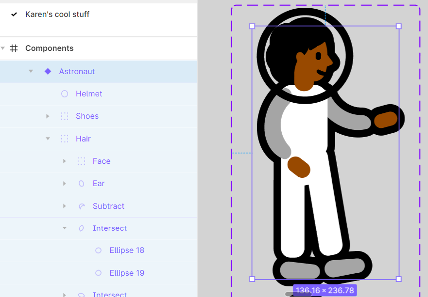

#### Adding texture

Whether you want to add decoration to a flat design or draw attention to actionable elements like buttons and text fields, the following features can add the finishing touch to your design.

**Blend modes**

The above icon looks a little boring. An easy way to create depth and interest in designs is to use Blend Modes on a layer. 

Above the Fill panel, you'll see a Layer panel. Change the setting from Pass Through to any other Blend Mode. To be honest with you, I still don't know exactly what each setting does; I usually cycle through options until I find one I like. 

To achieve the effect below, I set Difference on each of the leaf objects, as well as on the overarching group.

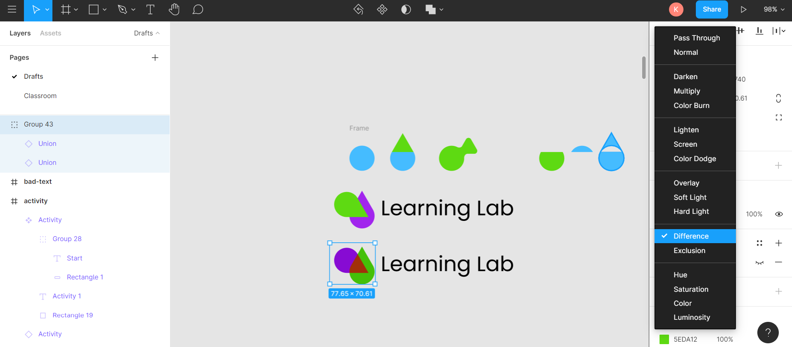

Blend modes help imitate real-life lighting situations. For those interested in color theory, they can be a valuable tool in creating believable lighting and color in your designs.

**Gradients**

Select a shape and click on the fill color. Above the color picker, there is a dropdown menu where you can change the fill from Solid to Linear (linear gradient). The default gradient has one color stop set to the original color of your object, and another color stop set to the original color at 0% opacity. You can adjust the opacity in the slider below the hue picker.

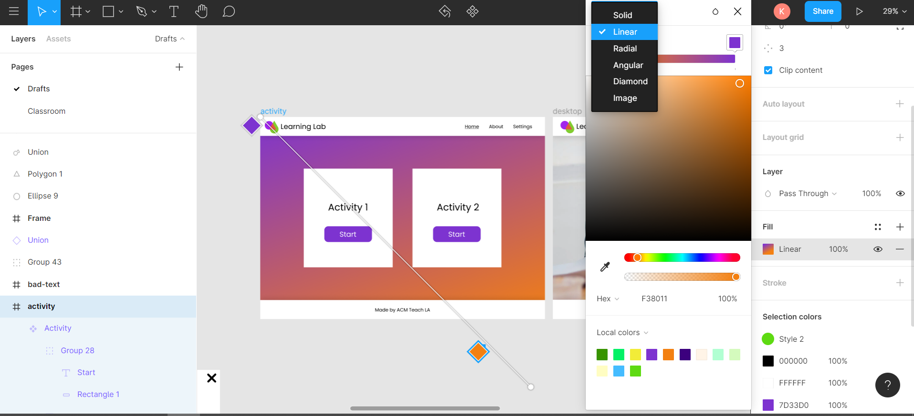

You can also add color stops by clicking anywhere on the color stop bar, and change the color of a color stop the way you would set any solid fill. 

Feel free to experiment with the different types of gradients, including Angular, Radial, and Diamond.

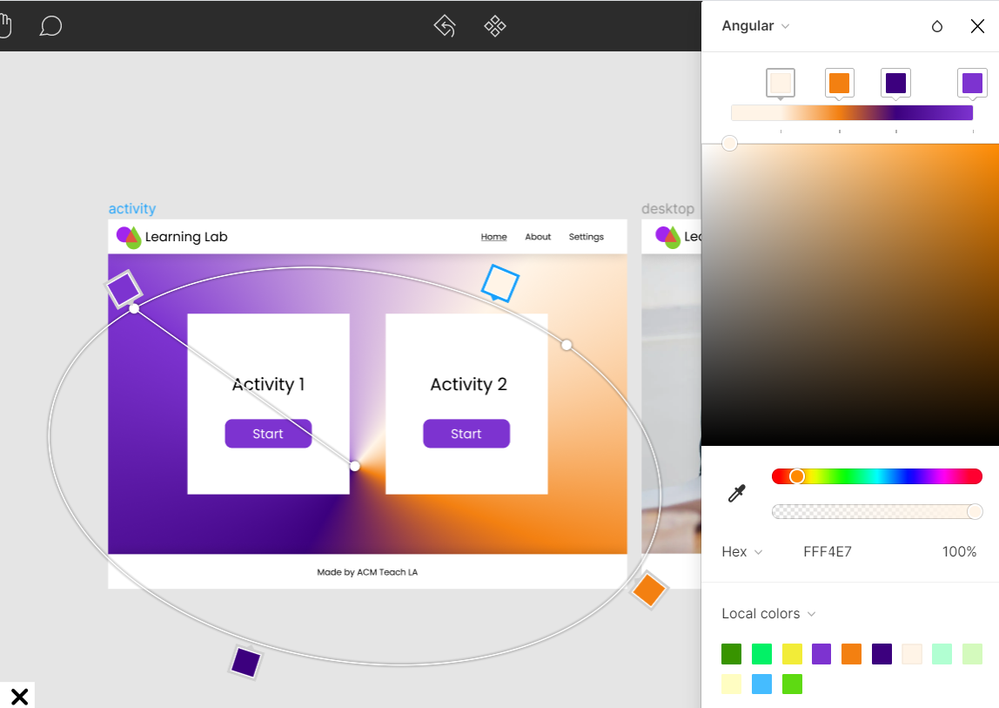

**Effects**

Drop (outer) and inner shadows can be used to draw attention to features like buttons. They can also provide a sense of depth to a design. In the below example, a drop shadow on the header separates it from the white background. You can adjust the offset of a shadow, as well as the blur amount (how close the light source is, or how sharp the shadow is) and the color.

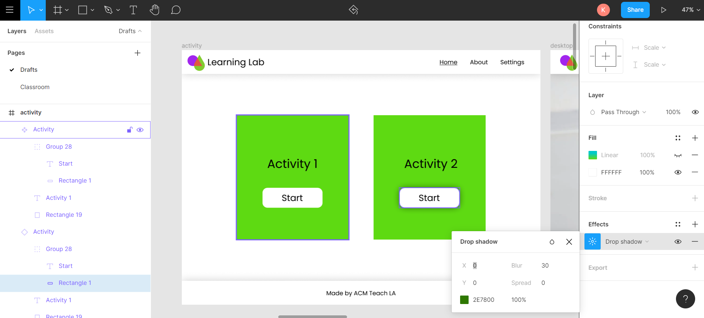

Blur effects are very "in" at the moment; try them out to create varying glassy and translucent effects. The important thing about the background blur is that it only works if the fill is less than 100% opaque.

Blurring can provide a sense of continuity in a design, because you can still see what's going on in the background. Apple uses it often in the home screen environment of iPhones.

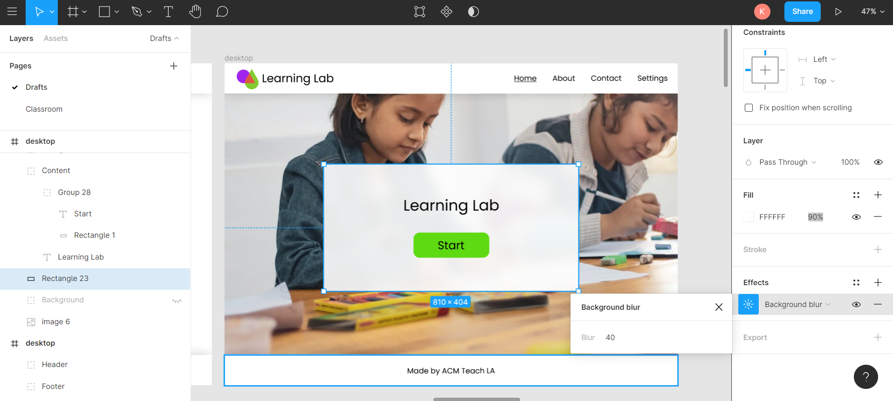

#### Smart selection

You'll find that you're often adjusting the spacing between elements, trying to make things even. If you highlight several objects and hover over the selection, a blue button on the bottom right will appear. Click it to auto-distribute your items.

Alternatively, on the top right of the options panel, you'll find a dropdown menu with different options for spacing out your items.

Once the objects are evenly distributed, you can do two things:

1. Adjust the exact spacing through the spacing field that appears below the rotation field in the options panel.
1. Hover over each object in the selection until a pink "smart selection" circle appears. Then, you can rearrange the order of the objects by dragging from the pink circle.

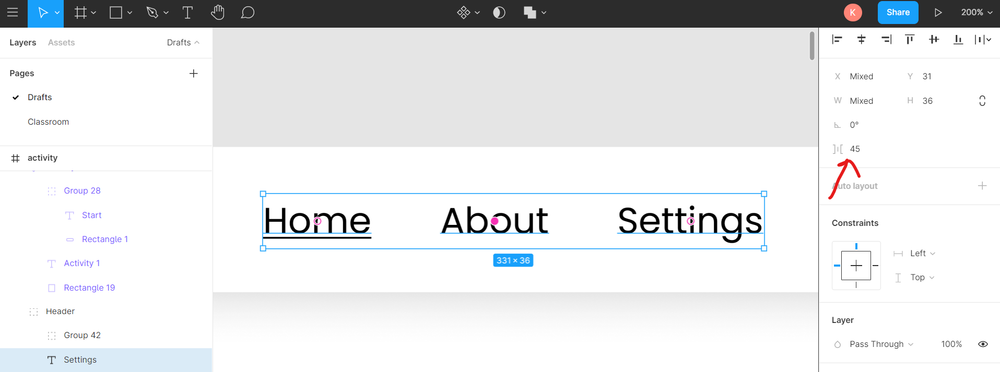

#### Using libraries and styles

#### Finding and using graphics

If you have a small team, you might find that you need some stock images, or that you don't have time to create icons (especially in the early stages of a design). 

At my previous graphic-design positions and internships, we've used [Pexels](https://www.pexels.com/) and [Unsplash](https://unsplash.com/) for high-quality stock imagery, although the variety is limited. It can be difficult to find an image that fits your purposes; my advice is to brainstorm as many keywords related to your image as possible,

Free stock photo sites often encourage users to cite the authors to thank them for their work. Consider adding a simple image citations page linked through the footer of your website or in the acknowledgments page of your app. Or, place an unintrusive watermark citation on the image itself.

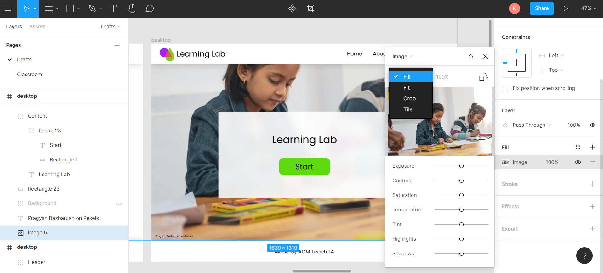

Image files like JPEGs, GIFs, and pngs are treated as fills in Figma. By clicking on the thumbnail in the Fill section, you can make basic adjustments to the lighting and color.

The most important setting for images is the sizing option, found in the adjustment panel next to the opacity setting. The default "Fill" allows you to adjust aspect ratio without distorting the image. Set "Crop" for more traditional, distortion-prone sizing.

For free icons, try [The Noun Project](https://thenounproject.com/). Most free downloads come with a watermark, which can be annoying, but the site works well enough for quick mockups. 

Other options include free icon sets found in the Figma community or on the web, although most come with the requirement that you must cite the original author.

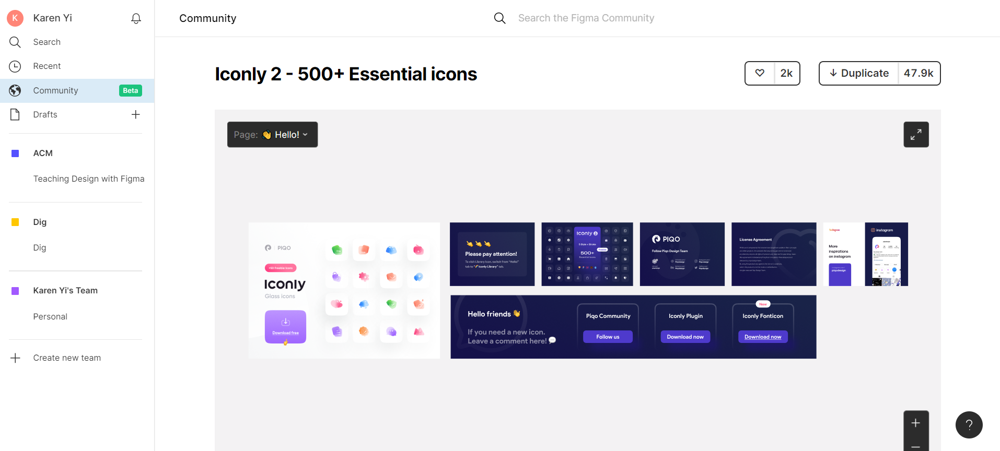

### Workflow

#### The magic keys

There are two VERY important keyboard keys in design applications. 

The first is `Alt`. It can:

1. Resize objects from center (try pressing `Alt` before dragging on a corner or side anchor)
1. Draw shapes from center (when you are actively drawing a shape and press `Alt`)
1. Change anchor points from mirrored to unmirrored (this is a topic that we won't have time to cover today)
1. Duplicate objects (when you press `Alt` before dragging)

The second is `Shift`. It can:

1. Move objects "stepwise" (press `Shift` + arrow keys to move objects in 10-pixel increments, instead of 1-pixel increments. You can adjust step size in Preferences)
1. Resize objects proportionately 
1. Rotate "stepwise" (press `Shift` while rotating to snap to the nearest 15 degrees)
1. Draw objects proportionately (when you are actively drawing a shape and press `Shift`)

You can use both keys together for a very precise designing experience.

#### Pages 

In my workflow, I usually start off on a page by churning out ideas. Then, I label this page "Drafts" and make a fresh page named "Final" to show reviewers like managers or colleagues. More fine-tuned versioning occurs with longer projects. Those familiar with GitHub (where this project is located...) will understand the fear of losing previous work.

Pages are located at almost the top of the layers panel.

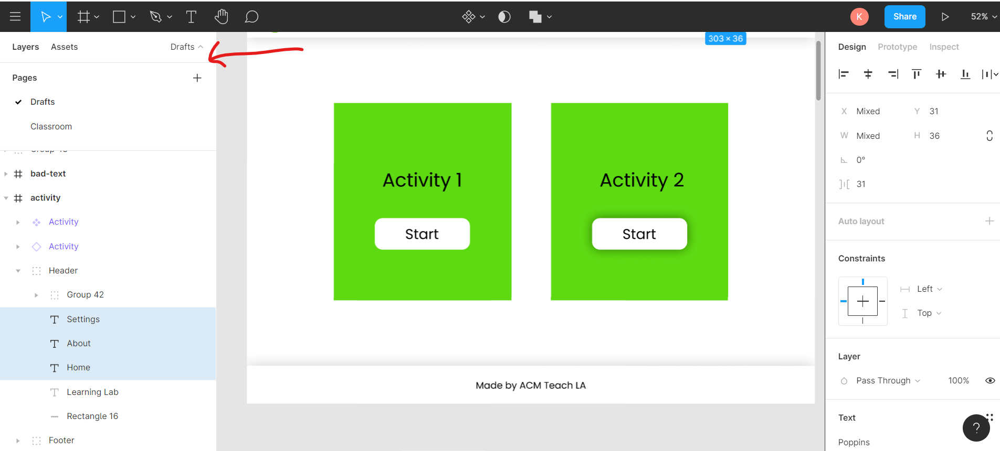

#### Naming 

Press `Ctrl` + `R` to batch rename multiple selected layers. You can even set 

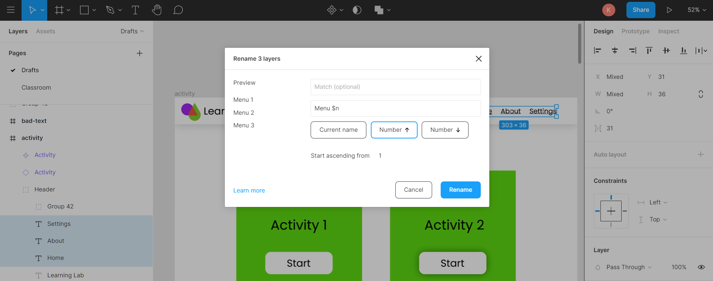

#### Comments

Design is very rarely successful without collaboration. Share your file with other designers using the Share button on the top right. (Thankfully, the interface is the same as the Google suite and other familiar software.)

The great thing about Figma is that it supports multiple users viewing and editing the same file simultaneously.

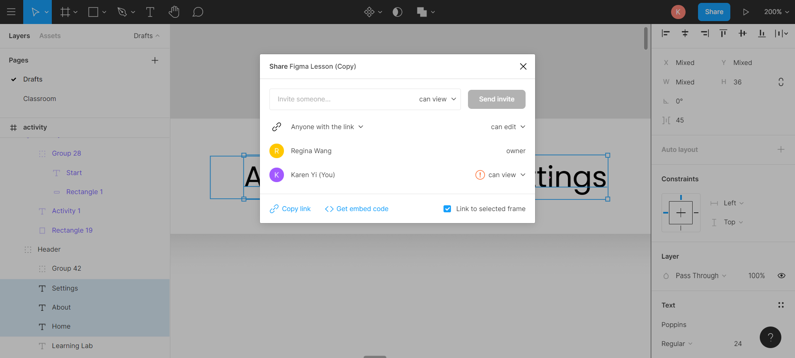

During design review meetings, I like to take notes (or else feedback goes in one ear and out the other). Press `C` to access the comment tool in Figma. Click anywhere in your workspace to leave a note! You can also set email notifications to keep up on important conversations.

You'll notice that the options panel changes completely: you can later use this to browse all comments in a file, including archived comments.

Comments are hidden unless you have selected the Comment tool.

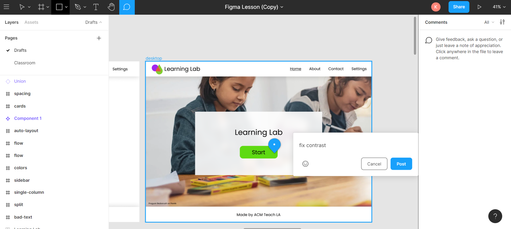

## Further reading

### Sources

[Ethics in Design: What Exactly Does That Mean? (Slate)](https://slate.com/technology/2018/08/ethics-in-design-what-exactly-does-that-mean.html)

[Design Ethics (Toptal)](https://www.toptal.com/designers/design-director/design-ethics)

### Keyboard shortcuts

Click the question mark at the bottom right hand corner of your workspace and click Keyboard Shortcuts for a full list. 